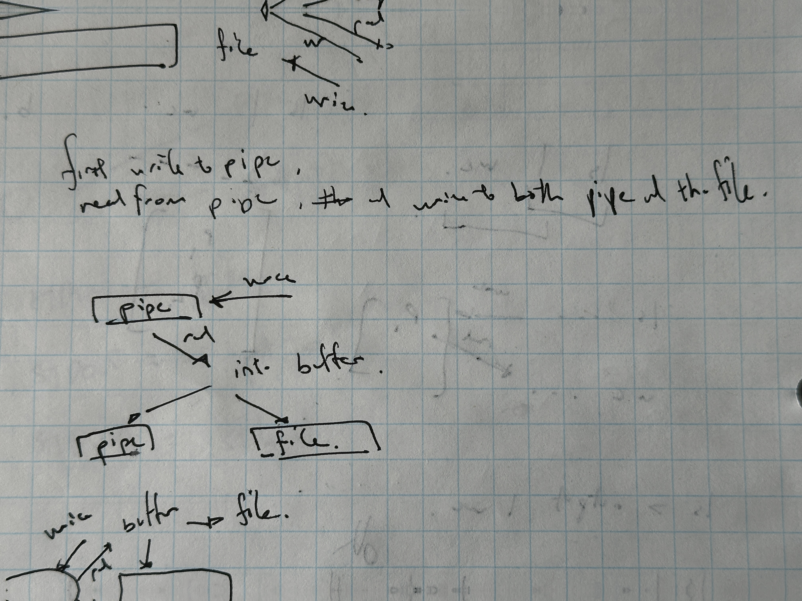

# UNIX Shell (qish)

Qish is an implementation of [OSTEP's wish shell](https://github.com/remzi-arpacidusseau/ostep-projects/blob/master/processes-shell/README.md) with additional pipe operator support. Thanks for visiting, and I would love for you to try the program out, test its limitations and give some feedback on the code!

Simply compile `./shell.c`\
then run the executable `./shell`

## Contents
- [Project Functionalities](#Functionalities)
- [OSTEP Tests](#Tests)
- [Performance](#Performance)
- [Contributing](#contributing)


## Functionalities:
- Built in command: exit, cd, path
- File redirection: >
- Parallel Commands: &
- <strong>Pipe functionality</strong> (e.g. `ls&ls >output.txt |wc -l`)
- Simple Program Errors
- External Commands: Should run almost any exec where it's input and output (additionally, even man and ssh work)


Here are [some commands](https://mally.stanford.edu/~sr/computing/basic-unix.html) to try out:


## Tests 
This passes the WISH tests. The `tests/`, `tests-out/`, `tester/`, `test-shell.sh` folders are from the OSTEP repo to help me do correctness tests.
`bash test-shell.sh` to run these tests.


## Performance

Qish Overall average: <strong>0.325ms</strong>\
Bash Overall average: <strong>30.761ms</strong>\
\
Interestingly, this shell performs quite fast despite the lack of optimization relative to bash. However, this is likely due to the lack of functionalities of the shell. (E.g. No histories from up down arrow).

More details on the tests can be found in `performance.c`. Try to run it!

```
Shell Performance Benchmark Results
Date: Wed Jan 22 10:51:45 2025
Number of iterations per test: 100


Results for Bash:
----------------------------------------
Basic Command Tests:
  Parallel execution time: 109.166 ms
  Redirection time: 2.915 ms
  Built-in command time: 2.237 ms

External Command Tests:
Command                         Time (ms)
----------------------------------------
ls                                  3.614
wc shell.c                          3.542
more shell.c                        3.830
diff shell.c performance.c           5.734
mkdir TEST                          2.912
rmdir TEST                          2.976
ls -R /etc                          6.305
ps aux                             51.802
uname -a                            2.554
ls -1 /etc | wc -l                  3.997

Summary:
  Average external command time: 8.727 ms
  Overall average: 30.761 ms


Results for qish:
----------------------------------------
Basic Command Tests:
  Parallel execution time: 0.358 ms
  Redirection time: 0.303 ms
  Built-in command time: 0.299 ms

External Command Tests:
Command                         Time (ms)
----------------------------------------
ls                                  0.294
wc shell.c                          0.288
more shell.c                        0.285
diff shell.c performance.c           0.290
mkdir TEST                          0.493
rmdir TEST                          0.293
ls -R /etc                          0.404
ps aux                              0.370
uname -a                            0.354
ls -1 /etc | wc -l                  0.309

Summary:
  Average external command time: 0.338 ms
  Overall average: 0.325 ms
```

## Code Structure and Design

(This serves to help me remember and for interested people to quickly understand structure)\
After running, the code operates as a continuous while loop. First, fetching the line that the user types in. Then, does (a lot of) parsing, which is the majority of the code.

`Since any shell implementation handles a set of internal commands (cd, exit, path...), and delegates external commands to external executables, the actual running of some program (such as ssh) is not done by the shell itself.`

Therefore, the main job of the shell for each command, is to:
1. Get input
2. Initial parsing for checking.
3. Check if the input is an internal command (something the shell itself should handle)
4. Otherwise, (do more parsing), find the right external executable's directory, and pass it correct arguments.
5. Rinse and repeat (unless error or exit)


Which is roughly the structure of this program in the while loop of the main function starting from `Line 85`.

There are a few more things that I found interesting and challenging.

### Some Context

At first to format the raw char array sequence, I made `null_terminate_input` and `collapse_white_space_group`. These serve to do preliminary formatting.

Then, as commands got more complex since there were redirection `>`, parallel execution `&`, and piping `|`. 

Redirection operators: `split_input_redir_operator`\
For parsing parallel and pipe commands: `parse_operator_in_args`

The program currently supports arbitrary configurations of parallel commands and piping of output (Something like `ls >output.txt |wc &ls & ls |  wc -l &ls`). But does not support "nested" redirection like `ls > output.txt > output2.txt`.

Before all of this processing begins, the semi-processed input (like, ls -l|wc)is first put into a `char parsed_input[MAXLINE]` array, then, we segment the individual characters into separate strings in `char **args`.

> char **args = malloc(MAXARGS * sizeof(char*));

`char **args` is the main memory block of strings that every other parsing operation operates on.

Keep in mind that the additional challenge was that these operators were allowed to have no space between neighboring commands.

### Parsing Strategy

For example `ls>filename.txt` or `ls >filename.txt` or `ls> filename.txt` can all be possible. Something like `ls&ls &ls& ls` is also possible.

In `split_input_redir_operator`, we first add each space segregated character sequence (as a string) into args, while at the same time handling redirection operator. (To Future: There could be a change in implementation here to allow for arbitrary amounts of > operators)

`parse_operator_in_args(&args, an operator either '&' or '|')` then does operation on each string argument of `char **args` to detect existence of operator symbol inside.

It first initalizes a `char **new_args` array to add items to.

Then, it uses a continuous parsing strategy to find the operator symbol inside a string argument. If there exists an operator, add to the new_args array, and continue searching inside the same string for more until there is non left. In addition, it adds the other relevant string contents, if exists, after the operator symbol, to the new_args array.

At end we get a new_args array with segregated content for a specific operator.

We can then run the function again with another operator.

For more information on the algorithm: `Line 321`

`// parse_operator_in_args(args, "|"): args {"ls|wc", ">", "output.txt"} -> {"ls", "|", "wc", ">", "output.txt"}`

Using this parsing technique, we get an array of arguments with clearly segregated operators.

This allows us to break commands up into parallel commands by the "&" operator. Which we run a for loop through.


### Pipe Implementation

The pipe implementation is the hardest engineering problem of the project. 

Several points:
- Information passing between proesses
- Handling information passing and redirection operator for a command

Initially I'd thought, ok I'd just create an array of pipes to pass information from one index to the next. And while parsing each command I could check for the existence of a redirection operator, and then send output of the program to both files.


It turns out not possible to direct process out to both an output file and a pipe at the same time (Unless using tee which is a non unix native command).

So, the idea was to implement a "personal pipe" for each of the separate commands. First, set my output for the process to the personal pipe. Then, read from the personal pipe into a buffer to pass it to the designated pipe which the next program reads from, AND, the output file for this specific command.



And I think it worked.


### Memory Management

This was a pain in the ass. 

As mentioned above, the main block of memory that is operated upon is the `char **args` block of memory.


Problems:
1. My parsing strategy causes the modification of the pointer contents in `char **args`, due to need of termination of each segment of a command.

For example, for parallel commands, as execv needs null-terminated string arrays to be passed in for each command. e.g. "ls", "-l", "&", "ls" is turned into "ls", "-l", NULL, "ls". For each command's execution, I would pass in the pointer referring to the first "ls" and the second "ls".

2. `parse_operator_in_args` also modifies the strings inside of each command via strdup (which is sometimes replaced). 

3. Point 2 also occurs in other functions associateed with parsing.


Therefore, 

