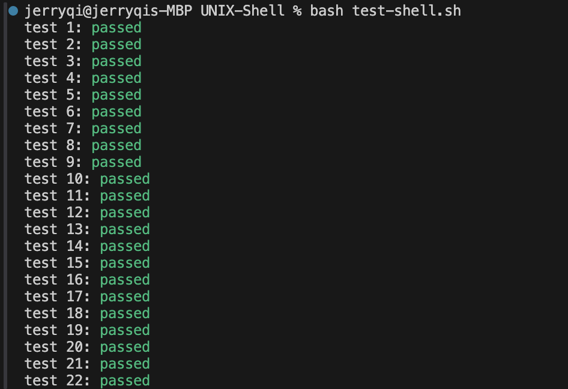

# UNIX Shell (qish)

Qish is an implementation of [OSTEP's wish shell](https://github.com/remzi-arpacidusseau/ostep-projects/blob/master/processes-shell/README.md) with additional pipe operator support. Thanks for visiting, and I would love for you to try the program out, test its limitations and give some feedback on the code!

Simply compile `./shell.c`\
then run the executable `./shell`

## Contents
- [Project Functionalities](#Functionalities)
- [OSTEP Tests](#Tests)
- [Performance](#Performance)
- [Contributing](#contributing)


## Functionalities:
- Built in command: exit, cd, path
- File redirection: >
- Parallel Commands: &
- <strong>Pipe functionality</strong> (e.g. `ls&ls >output.txt |wc -l`)
- Simple Program Errors
- External Commands: Should run almost any exec where it's input and output


Here are [some commands](https://mally.stanford.edu/~sr/computing/basic-unix.html) to try out:


## Tests 
This passes the WISH tests. The `tests/`, `tests-out/`, `tester/`, `test-shell.sh` folders are from the OSTEP repo to help me do correctness tests.
`bash test-shell.sh` to run these tests.




## Performance

Qish Overall average: <strong>0.325ms</strong>\
Bash Overall average: <strong>30.761ms</strong>\
\
Interestingly, this shell performs quite fast despite the lack of optimization relative to bash. However, this is likely due to the lack of functionalities of the shell. (E.g. No histories, but it can actually run ssh and man pages).

More details on the tests can be found in `performance.c`. Try to run it!

```
Shell Performance Benchmark Results
Date: Wed Jan 22 10:51:45 2025
Number of iterations per test: 100


Results for Bash:
----------------------------------------
Basic Command Tests:
  Parallel execution time: 109.166 ms
  Redirection time: 2.915 ms
  Built-in command time: 2.237 ms

External Command Tests:
Command                         Time (ms)
----------------------------------------
ls                                  3.614
wc shell.c                          3.542
more shell.c                        3.830
diff shell.c performance.c           5.734
mkdir TEST                          2.912
rmdir TEST                          2.976
ls -R /etc                          6.305
ps aux                             51.802
uname -a                            2.554
ls -1 /etc | wc -l                  3.997

Summary:
  Average external command time: 8.727 ms
  Overall average: 30.761 ms


Results for qish:
----------------------------------------
Basic Command Tests:
  Parallel execution time: 0.358 ms
  Redirection time: 0.303 ms
  Built-in command time: 0.299 ms

External Command Tests:
Command                         Time (ms)
----------------------------------------
ls                                  0.294
wc shell.c                          0.288
more shell.c                        0.285
diff shell.c performance.c           0.290
mkdir TEST                          0.493
rmdir TEST                          0.293
ls -R /etc                          0.404
ps aux                              0.370
uname -a                            0.354
ls -1 /etc | wc -l                  0.309

Summary:
  Average external command time: 0.338 ms
  Overall average: 0.325 ms
```
