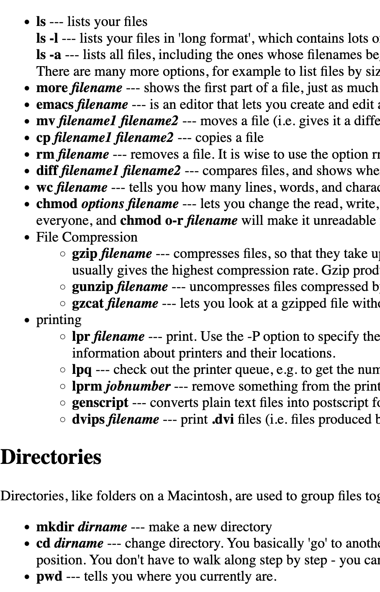

# UNIX Shell (qish)

Qish is an implementation of [OSTEP's wish shell](https://github.com/remzi-arpacidusseau/ostep-projects/blob/master/processes-shell/README.md) <strong>with additional [pipe operator support](#pipe-implementation)</strong>.
 
Thanks for visiting, and I would love for you to try the program out, and give some feedback on the code.


Simply compile `./shell.c`\
then run the executable `./shell`

## Contents
- [Project Functionalities](#Functionalities)
- [Known Limitations](#Known-Limitations)
- [OSTEP Tests](#Tests)
- [Performance](#Performance)
- [Code Structure and Design](#Code-Structure-and-Design)


## Functionalities:
- Built in command: exit, cd, path
- File redirection: >
- Parallel Commands: &
- <strong>Pipe functionality</strong> (e.g. `ls&ls >output.txt |wc -l`)
- Simple Program Errors
- External Commands: Should run almost any exec where it's input and output (additionally, even man and ssh work)

## Known-Limitations
- No command history (up/down arrows)
- No nested redirection (e.g., `ls > out1.txt > out2.txt`)
- No environment variable support
- Limited path management


Here are [some commands](https://mally.stanford.edu/~sr/computing/basic-unix.html) to try out:



## Tests 
This passes the WISH correctness tests. The `tests/`, `tests-out/`, `tester/`, `test-shell.sh` folders are from the OSTEP repo to help me do correctness tests.
`bash test-shell.sh` to run these tests.


## Performance

Qish Overall average: <strong>0.298ms</strong>\
Bash Overall average: <strong>30.606ms</strong>\
\
Interestingly, qish performs quite fast despite the lack of optimization relative to bash. However, this is likely due to the lack of functionalities of the shell. (E.g. No histories from up down arrow).

The tests cover a variety of operations including basic file operations, file content operations, directory manipulation, complex piping operations, to system information in attempt to simulate performance.

More details on the tests can be found in `performance.c`.

```benchmark.txt
Shell Performance Benchmark Results
Date: Sun Jan 26 15:24:02 2025
Number of iterations per test: 100


Results for Bash:
----------------------------------------
Basic Command Tests:
  Parallel execution time: 108.886 ms
  Redirection time: 2.651 ms
  Built-in command time: 2.014 ms

External Command Tests:
Command                         Time (ms)
----------------------------------------
Simple directory listing (ls)                                           3.322
File Content Analysis (wc shell.c)                                      3.643
File Content Viewing (more shell.c)                                     3.793
File Comparison (diff shell.c performance.c)                            5.720
Directory Creation (mkdir TEST)                                         3.025
Directory Removal (rmdir TEST)                                          3.747
Recursive directory traversal (ls -R /etc)                              6.848
Process Information - Heavy system call (ps aux)                        51.784
System information (uname -a)                                           2.564
Directory listing with pipe and counting (ls -1 /etc | wc -l)           4.267
sort unique with output (cat shell.c | sort | uniq > uniq.txt)          7.842
remove test file, if exists (rm -f uniq.txt)                            3.133


Summary:
  Average external command time: 8.871 ms
  Overall average: 30.606 ms


Results for qish:
----------------------------------------
Basic Command Tests:
  Parallel execution time: 0.302 ms
  Redirection time: 0.294 ms
  Built-in command time: 0.289 ms

External Command Tests:
Command                         Time (ms)
----------------------------------------
Simple directory listing (ls)                                           0.296
File Content Analysis (wc shell.c)                                      0.302
File Content Viewing (more shell.c)                                     0.312
File Comparison (diff shell.c performance.c)                            0.318
Directory Creation (mkdir TEST)                                         0.314
Directory Removal (rmdir TEST)                                          0.329
Recursive directory traversal (ls -R /etc)                              0.324
Process Information - Heavy system call (ps aux)                        0.293
System information (uname -a)                                           0.288
Directory listing with pipe and counting (ls -1 /etc | wc -l)           0.295
sort unique with output (cat shell.c | sort | uniq > uniq.txt)          0.341
remove test file, if exists (rm -f uniq.txt)                            0.323

Summary:
  Average external command time: 0.307 ms
  Overall average: 0.298 ms


```

## Code-Structure-and-Design

(This serves to help me remember and for interested people to quickly understand structure)\
After starting, the code operates as a continuous while loop.

First, fetching the line that the user types in. Then, does (a lot of) parsing, which is the majority of the code.

`Since any shell implementation handles a set of internal commands (cd, exit, path...), and delegates external commands to external executables, the actual running of some program (such as ssh) is not done by the shell itself.`

Therefore, the main job of the shell for each command, is to:
1. Get input
2. Initial parsing for checking.
3. Check if the input is an internal command (something the shell itself should handle)
4. Otherwise, (do more parsing), find the right external executable's directory, and pass it correct arguments.
5. Rinse and repeat (unless error or exit)


Which is roughly the structure of this program in the while loop of the main function starting from `Line 85`.

There are a few more things that I found interesting and challenging.

### Some Context

At first to format the raw char array sequence, I made `null_terminate_input` and `collapse_white_space_group`. These serve to do preliminary formatting.

Then, as commands got more complex since there were redirection `>`, parallel execution `&`, and piping `|`. 

Redirection operators: `split_input_redir_operator`\
For parsing parallel and pipe commands: `parse_operator_in_args`

The program currently supports arbitrary configurations of parallel commands and piping of output (Something like `ls >output.txt |wc &ls & ls |  wc -l &ls`). But does not support "nested" redirection like `ls > output.txt > output2.txt`.

Before all of this processing begins, the semi-processed input (like, ls -l|wc)is first put into a `char parsed_input[MAXLINE]` array, then, we segment the individual characters into separate strings in `char **args`.

> `char **args = malloc(MAXARGS * sizeof(char*));`

`char **args` is the main memory block of strings that every other parsing operation operates on.

### Parsing Strategy

For example `ls>filename.txt` or `ls >filename.txt` or `ls> filename.txt` can all be possible. Something like `ls&ls &ls& ls` is also possible.

The additional challenge was that these operators were allowed to have no space between neighboring commands.

In `split_input_redir_operator,` we first add each space-segregated character sequence (as a string) into args while at the same time handling the redirection operator. (FUTURE: There could be a change in implementation here to allow for arbitrary amounts of > operators)

`parse_operator_in_args(&args, an-operator-either-'&'-or-'|')` then does an operation on each string argument of `char **args` to detect the existence of the operator symbol inside.

It first initalizes a `char **new_args` array to add items to.

Then, it uses a continuous parsing strategy to find the operator symbol inside a string argument. If there exists an operator, add to the new_args array, and continue searching inside the same string for more until there is non left. In addition, it adds the other relevant string contents, if they exist, after the operator symbol to the new_args array.

At end we get a new_args array with segregated content for a specific operator.

We can then run the `parse_operator_in_args` function again with another operator.

For more information on the algorithm: `Line 321`

`// parse_operator_in_args(args, "|"): args {"ls|wc", ">", "output.txt"} -> {"ls", "|", "wc", ">", "output.txt"}`

Using this parsing technique, we get an array of arguments with clearly segregated operators.

For example, this enables us to break commands up into parallel commands by the "&" operator. Which we run a for loop through.


### Pipe Implementation

The pipe implementation was the hardest engineering problem of the project, and it was beyond OSTEP's specifications.

Points to solve:
1. Output passing between consecutive commands
2. Handling > operator and | at the same time

Initially, I'd thought, ok, I'd create an array of pipes to pass information from one index to the next. While parsing each command, I could check for the existence of a redirection operator and then send the output of the program to both files.


It turns out that this solution was too naive. It's not possible to direct the process out to both an output file and a pipe at the same time (Unless using `tee`, which is a non-unix native command).

So, the idea was to implement a "personal pipe" for each of the separate commands. First, set my output for the process to the personal pipe. Then, read from the personal pipe into a buffer to pass it to the designated pipe which the next program reads from, AND, the output file for this specific command.


And I think it worked.

### Memory Management

This was a pain in the 🍑.

As mentioned above, the main block of memory operated upon is the `char **args` block.

#### Problems
1. My parsing strategy causes the modification of the total number of malloc'ed elements in `char **args`, due to parsing for non-properly formatted operators. 

For example, the args of "ls -l| wc" would have size 3 and then would have size 4 after parsed. It is set to a more extended array of strings when doing `parse_operator_in_args`.

2. String constants in args are not free'd at the end of each loop because they are set to NULL for proper command formatting.

For example, for parallel commands, as execv needs null-terminated string arrays to be passed in for each command. e.g. "ls", "-l", "&", "ls" is turned into "ls", "-l", NULL, "ls". For each command's execution, I would pass in the pointer referring to the initial string of the first command. The first pointer would be "ls" and the second is also "ls".

(FUTURE: I could've just used string literals for operators when parsing them, then I don't need to free)

3. Other miscellancious cases


#### My strategy

Since `args` is the memory block that stores the information for all commands and their parsed form, we can devise a iterative mechanism to free `args` after command execution.

From `Line 194 - 196`, we free the args memory block using `free_args_elements`.

Ok, but just freeing it naively until the memory is a NULL element will not work due to <strong> Problem 1</strong>.

Ok, there may exist elements after NULL pointers, so maybe we can just check until MAXARGS length. But I realized that malloc'd memory space might still contain random non-NULL garbage values, which causes double-free errors.

So, this ultimately needed a tracking mechanism for the total number of arguments that are in the args to free. Therefore, I implemented a counter mechanism globally using `number_of_args`. And, in `parse_operator_in_args`, whenever we are incrementing the size of `args`, I'd count the new number of arguments. Using the old global size, I'd free the old args array accordingly. Then I'd update the global_size to the new args size.

This solves problem 1. 

Problem 2 is an extension of problem 1. Although each part of args is freed at the end of each loop, some operators are set to NULL.

Therefore, before the explicit set to NULL of the operator, we free the operator first.

Examples: 
`Line 479` - We free "&" in `configure_parallel` before the set to NULL, which is meant to segregate processing by execv for each command.
`Line 641` - We free "|" in `execute_piped_commands` before we set the pointer to it to NULL for proper execv formatting.
`Line 666` - Free ">" before we set it to NULL for execv formatting. We didn't need to free the filename after it because the ending free loop in main will catch it.

By explicitly freeing every operator string before we set that pointer position to NULL for execv processing, we prevent the memory leak.

Problem 3 is the other cases:
- Processing and freeing global var paths
- Freeing input at the end
- Freeing function locally created strdup variables (e.g. the `file_name` part of the struct in `execute_piped_command`)
